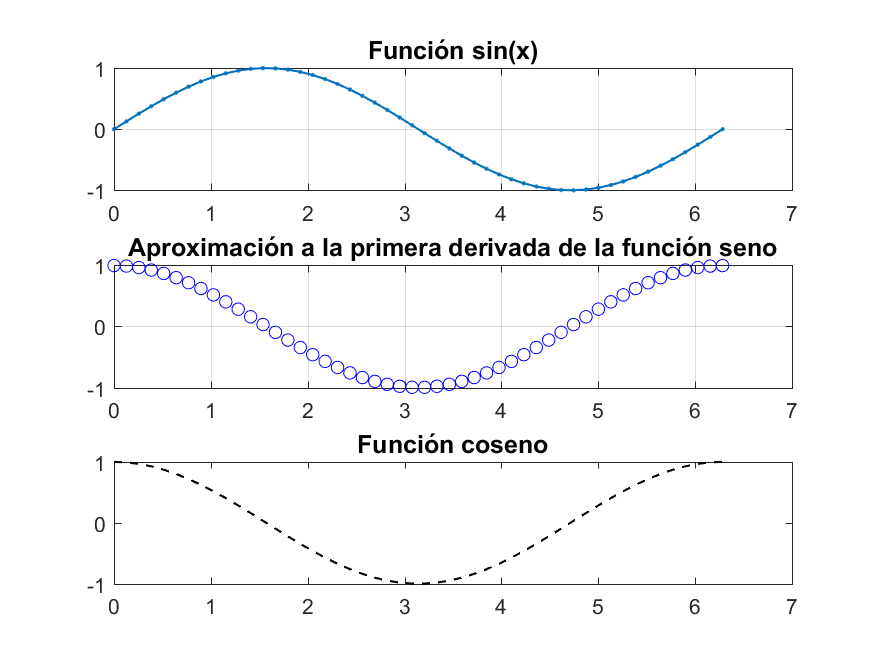

# MATLAB Codes Repository

Welcome to my MATLAB codes repository! This repository contains various MATLAB scripts and functions covering a range of topics and simulations.

## Implemented Scripts and Simulations

- **Bisection and Free Fall**: MATLAB scripts for bisection method and simulating free fall.
- **Ball Bouncing Simulation**: MATLAB simulation of a bouncing ball.
  
- **Derivative Calculation**:
  - Using progressive, central, and regressive difference methods.
  - Using another derivative calculation method.
  - 
- **Integration using Simpson's Method**: MATLAB script for numerical integration using Simpson's rule.
- **Polynomials**: MATLAB scripts for polynomial operations.
- **Traffic Simulation on a Road**: MATLAB simulation of traffic flow on a road.
  

## Repository Structure

- `/Bisection_free_fall`: Contains MATLAB scripts for bisection and free fall simulations.
- `/Bouncing_ball_simulation`: Contains MATLAB scripts for the ball bouncing simulation.
- `/Derivative1`: Contains MATLAB scripts for derivative calculation using different methods.
- `/Derivative2`: Contains MATLAB scripts for derivative calculation using different methods.
- `/integration_simpsons_method`: Contains MATLAB script for integration using Simpson's method.
- `/polynomials`: Contains MATLAB scripts for polynomial operations.
- `/traffic_simulation`: Contains MATLAB script for traffic simulation.

Feel free to explore and use these MATLAB scripts for your learning and experimentation.

---

Enjoy exploring the MATLAB scripts and simulations in this repository!
